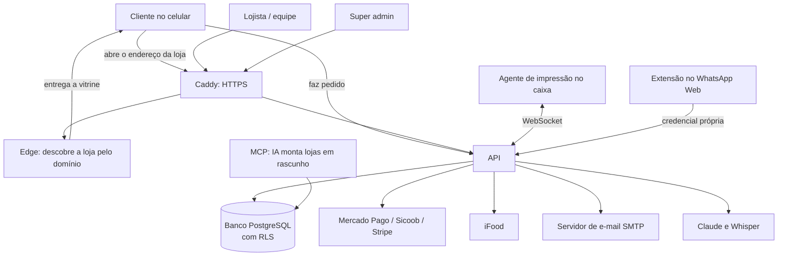
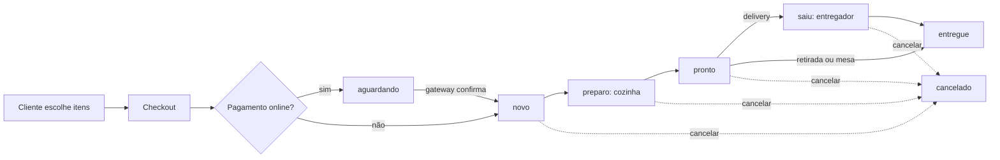
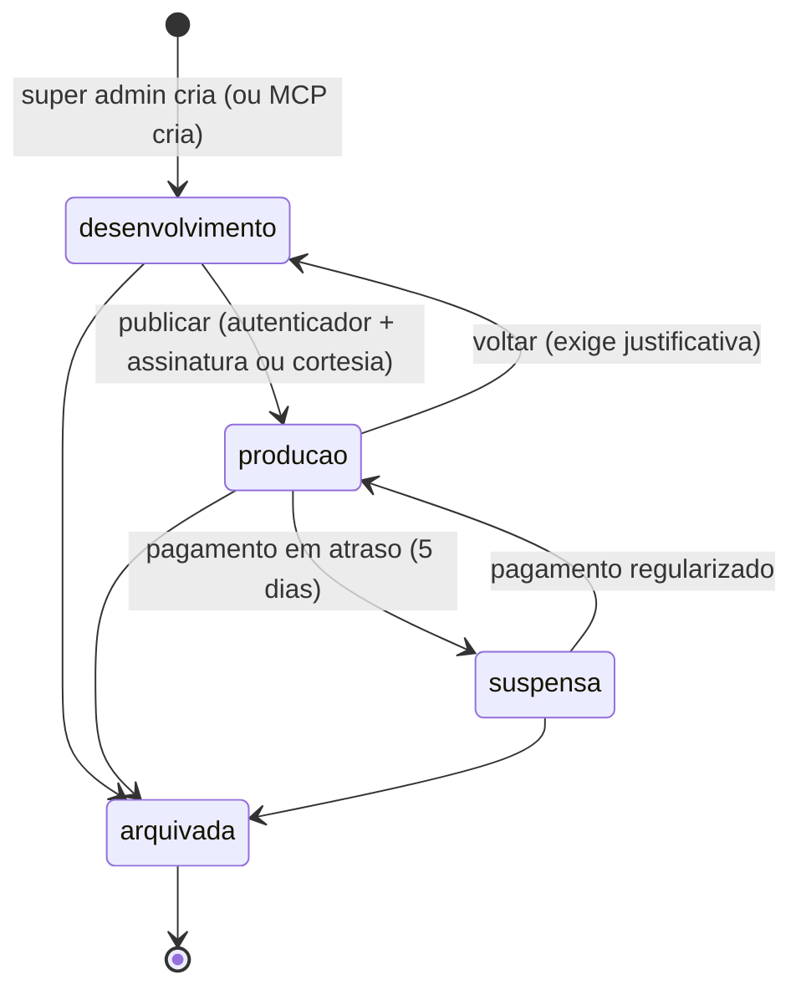
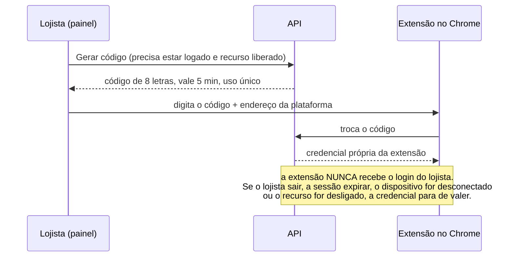
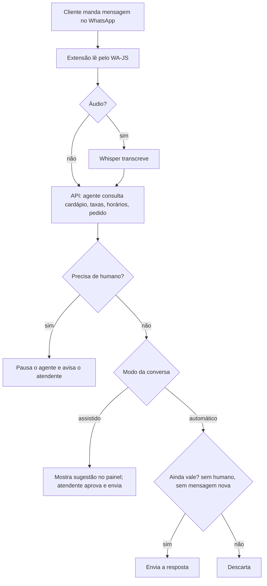
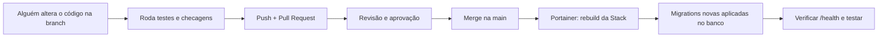

# Guia didático do PediuLanchou

Material para quem acabou de entrar na equipe e **não precisa ter conhecimento técnico** para começar. Explica o que a plataforma faz, como cada tela funciona, como configurar tudo (pelas telas, pelo Portainer ou pelo código) e o que ainda pode melhorar.

> Mantenha este guia vivo: quando uma tela, variável ou rotina mudar, atualize aqui. Estado do trabalho em andamento: [`../HANDOFF.md`](../HANDOFF.md).

## Como ler este guia

| Você vai... | Leia |
|---|---|
| Usar o painel (cadastrar produto, ver pedidos, atender no WhatsApp) | Partes 1, 2, 3, 4 e 5 |
| Cuidar do servidor (Portainer, domínios, e-mail, chaves) | Partes 1, 2, 6, 7 e 9 |
| Mexer no código | Partes 1, 2, 3, 8 e 9 |
| **Instalar um cliente novo** (impressora, celulares de garçom, domínio) | **Parte 12** (checklist) |
| Só entender o produto e as próximas ideias | Partes 1, 2 e 10 |

Tudo que está marcado com ✅ **está implementado e testado por testes automáticos**. Tudo marcado com ⚠️ **existe no código mas ainda não foi validado no mundo real** (por exemplo, com o WhatsApp de verdade). Não prometa a um cliente algo marcado com ⚠️ sem testar antes.

---

## Parte 1 — O que é o PediuLanchou

O PediuLanchou é uma **plataforma de delivery para vários restaurantes (lojas) ao mesmo tempo**. Pense num shopping center:

- O **shopping** é a plataforma. Quem administra é a nossa equipe (**super admin**).
- Cada **loja** é um restaurante dentro do shopping, com endereço próprio na internet (ex.: `burger-lab.pediulanchou.com.br`) e dono próprio (o **lojista**).
- Os **clientes** abrem a vitrine da loja, escolhem os itens e fazem o pedido.
- A cozinha recebe o pedido (na tela, e impresso se houver impressora), o entregador leva, o cliente acompanha.
- **Um restaurante nunca enxerga os dados de outro.** Esta é a regra mais importante de toda a plataforma.

### O que a plataforma entrega

| Para quem | O que oferece |
|---|---|
| Cliente | Vitrine com cardápio, carrinho, pedido, acompanhamento por link, conta com histórico (login por código no e-mail) |
| Lojista | Painel: pedidos, cardápio, aparência, pagamentos, entrega, impressão, domínios, equipe, clientes, atendimento WhatsApp |
| Equipe da loja | PDV (caixa/balcão), tela do garçom (mesas), tela do entregador |
| Nossa equipe | Super admin: criar/publicar lojas, assinaturas, desempenho, alertas, logs, versões, rodapé das lojas, tokens do MCP |
| Automação | MCP (para uma IA montar lojas em rascunho), agente de impressão, extensão do Chrome para WhatsApp |

---

## Parte 2 — Glossário (os termos que você vai ouvir)

Leia esta tabela uma vez; volte quando um termo aparecer.

### Negócio

| Termo | Significa |
|---|---|
| **Conta (tenant)** | O "dono" de uma ou mais lojas. É a unidade de isolamento: contas diferentes nunca se enxergam. |
| **Loja (store)** | Um restaurante com vitrine própria. Pertence a uma conta. |
| **Slug** | O nome curto da loja no endereço. `burger-lab` → `burger-lab.pediulanchou.com.br`. Só letras minúsculas, números e hífen. |
| **Status da loja** | `desenvolvimento` (rascunho, só a equipe vê), `producao` (no ar para clientes), `suspensa` (tirada do ar por falta de pagamento), `arquivada` (encerrada). |
| **Publicar** | Passar a loja de `desenvolvimento` para `producao`. Exige assinatura ativa **ou** um motivo de cortesia, e o código do autenticador. |
| **Super admin** | Painel da nossa equipe, separado do painel do lojista. |
| **Painel do lojista** | Onde o dono/gerente administra a loja (`/painel`). |
| **PDV** | "Ponto de venda": a tela do caixa para lançar pedidos de balcão e receber pagamento. |
| **Pedido** | Segue o fluxo: `aguardando` (pagamento online pendente) → `novo` → `preparo` → `pronto` → `saiu` (só entrega) → `entregue`; pode ser `cancelado` até antes de entregar. |
| **Canal** | De onde o pedido veio: `loja` (vitrine), `pdv`, `garcom`, `ifood`. |
| **Zona de entrega** | Região atendida com taxa e tempo estimado. |
| **Zona de impressão** | Setor que recebe o cupom (Cozinha, Bar, Caixa). Cada categoria do cardápio aponta para uma zona. |
| **Cortesia** | Publicar uma loja sem assinatura, com motivo registrado (parceiro, piloto). |
| **Trial** | Período de teste gratuito de uma assinatura. |
| **Funcionalidades por loja** | Checklist no super admin que libera recursos (atendimento WhatsApp, agente de IA, disparos...) loja a loja. |

### Tecnologia (explicado sem jargão)

| Termo | Significa |
|---|---|
| **Servidor** | Um computador ligado 24 h que roda a plataforma. |
| **API** | O "garçom invisível": recebe pedidos das telas ("quero a lista de pedidos") e responde. Toda tela fala com a API. |
| **Banco de dados** | Onde tudo fica guardado (lojas, produtos, pedidos). Usamos PostgreSQL, hospedado no Supabase. |
| **Migration** | Um arquivo SQL que muda a estrutura do banco (criar tabela, coluna). Rodam **em ordem**, uma única vez. |
| **RLS (Row Level Security)** | Cadeado do banco: mesmo que o código erre, o banco só entrega linhas da conta certa. |
| **Role** | Um "usuário do banco" com permissões limitadas. Temos três: `app_api` (lojas), `platform_api` (super admin), `mcp_agent` (automação). |
| **Edge** | Serviço que descobre qual loja corresponde ao domínio acessado e entrega a vitrine na versão certa. |
| **Frontend / UI** | As telas (o que você vê no navegador). Feitas em React. |
| **Backend** | A parte invisível (API, banco). |
| **Domínio / DNS** | Endereço na internet e a "agenda" que diz para qual servidor ele aponta. |
| **HTTPS / certificado** | O cadeado do navegador. O Caddy emite e renova sozinho. |
| **Docker / imagem / container** | Docker empacota o programa com tudo que ele precisa (imagem); o container é a imagem rodando. |
| **Stack (Portainer)** | Conjunto de containers que sobem juntos, descritos num arquivo `docker-compose`. |
| **Portainer** | Painel visual para gerenciar o Docker sem digitar comandos. |
| **Caddy** | Servidor "porteiro": recebe a internet, cuida do HTTPS e encaminha para API/edge/MCP. |
| **Variável de ambiente** | Configuração passada ao programa de fora do código (senhas, chaves, endereços). **Nunca** vai para o Git. |
| **Deploy** | Colocar uma versão nova no ar. |
| **Git / branch / PR** | Histórico do código. Branch = linha de trabalho paralela. PR (pull request) = pedido para juntar uma branch na principal (`main`) com revisão. |
| **Commit / push** | Salvar uma alteração no histórico / enviá-la ao GitHub. |
| **TOTP / autenticador** | Código de 6 dígitos que muda a cada 30 s (app tipo Google Authenticator). |
| **Step-up** | Pedir o código do autenticador de novo antes de uma ação sensível (publicar, mudar chave). |
| **Webhook** | Aviso automático que um serviço externo (Stripe, Mercado Pago) manda para nossa API. |
| **SMTP** | Serviço de envio de e-mail (usado no código de login do cliente). |
| **PWA** | Site que se instala como aplicativo no celular. |
| **MCP** | Protocolo que deixa uma IA (como o Claude) usar "ferramentas" da plataforma — aqui, para montar lojas em `desenvolvimento`. Nunca publica nem mexe em loja no ar. |
| **ESC/POS** | Linguagem das impressoras térmicas de cupom. |
| **Extensão do Chrome** | Programa que roda dentro do navegador. A nossa trabalha dentro do WhatsApp Web. |
| **WA-JS** | Biblioteca de código aberto que "conversa" com o WhatsApp Web (ler mensagens, enviar). |
| **LLM / agente de IA** | Modelo de linguagem (Claude) que escreve respostas usando as ferramentas da loja. |
| **Whisper** | Modelo que transforma áudio em texto. |
| **Token** | Senha longa gerada pelo sistema (ex.: do MCP ou da extensão). Mostrada uma vez; guardamos só um resumo (hash). |
| **Hash** | "Impressão digital" irreversível de um segredo. Dá para conferir, não dá para recuperar. |

---

## Parte 3 — Quem pode fazer o quê (perfis)

Cada pessoa da equipe de uma loja tem **um perfil**. O perfil define o que aparece no menu.

| Perfil | PDV | Garçom | Entregador | Cancelar pedido | Estornar | Dashboard | Pedidos/Clientes/WhatsApp | Cardápio | Loja (aparência, pagamentos, entrega...) | Usuários |
|---|---|---|---|---|---|---|---|---|---|---|
| **admin** | ✔ | ✔ | ✔ | ✔ | ✔ | ✔ | ✔ | ✔ | ✔ | ✔ |
| **gerente** | ✔ | ✔ | ✔ | ✔ | ✔ | ✔ | ✔ | ✔ | ✔ | — |
| **suporte** | ✔ | ✔ | ✔ | ✔ | — | ✔ | ✔ | — | — | — |
| **balcao** | ✔ | — | — | — | — | — | — | — | — | — |
| **garcom** | — | ✔ | — | — | — | — | — | — | — | — |
| **entregador** | — | — | ✔ | — | — | — | — | — | — | — |

(Fonte: `packages/shared/src/roles.ts`.) O super admin é outro sistema, com login próprio e autenticador obrigatório.

---

## Parte 4 — Tecnologias usadas

| Camada | Tecnologia | Para que serve | Onde está |
|---|---|---|---|
| Linguagem | **TypeScript** (Node.js 22) | Todo o código, com checagem de tipos | todo o repositório |
| Organização | **Monorepo npm** (workspaces) | Vários programas num só repositório | `package.json` |
| API | **Fastify** | Servidor de API rápido | `apps/api` |
| Validação | **Zod** | Confere os dados que chegam (ex.: preço, ids) | `apps/api`, `packages/shared` |
| Banco | **PostgreSQL** (Supabase) com **RLS** | Dados e isolamento entre contas | `packages/db` |
| Telas | **React + Vite + Tailwind** | Vitrine, painel, PDV, super admin | `apps/web`, `apps/platform` |
| Ícones/QR | lucide-react, qrcode | Interface e QR do Pix | telas |
| Edge | Fastify + proxy | Resolve domínio → loja → versão do app | `apps/web-edge` |
| IA para lojas | **MCP** (SDK oficial) | Montar lojas em rascunho por IA | `apps/mcp` |
| Impressão | **ESC/POS**, agente local | Cupom em impressora térmica | `packages/escpos`, `apps/print-agent` |
| E-mail | **Nodemailer** (SMTP) | Código de login do cliente | `apps/api/src/mailer.ts` |
| Pagamentos | **Mercado Pago**, **Sicoob** (Pix/cartão da loja) · **Stripe** (assinatura da plataforma) | Cobranças | `apps/api/src/gateways.ts`, `billing.ts` |
| Delivery externo | **iFood** | Receber pedidos do iFood | `apps/api/src/ifood.ts` |
| Hospedagem | **Docker**, **Portainer**, **Caddy** | Colocar no ar com HTTPS automático | `Dockerfile`, `deploy/` |
| Atendimento WhatsApp | **Extensão Chrome (Manifest V3)** + **WA-JS 4.6.1** | Ler/enviar mensagens no WhatsApp Web | `apps/whatsapp-extension` |
| IA de atendimento | **Claude (Anthropic API)** | Sugerir/enviar respostas | `apps/api/src/agent.ts`, `llm.ts` |
| Áudio | **Whisper** | Transcrever áudio | `apps/api/src/llm.ts` |
| Testes | **node:test**, **PGlite** (Postgres em memória) | Testes automáticos sem banco real | pastas `test/` |

---

## Parte 5 — Como tudo se conecta (fluxogramas)

Os diagramas abaixo aparecem desenhados no GitHub. Em outros editores, são texto no formato Mermaid.

### 5.1 Visão geral



### 5.2 Caminho de um pedido



O servidor **sempre recalcula** preço, adicionais e taxa; o navegador só manda "qual produto e quantas unidades". Ao entrar em `novo`, o sistema imprime o cupom por zona (se houver impressora) e avisa a tela.

### 5.3 Vida de uma loja



O MCP só escreve em lojas em `desenvolvimento` e **nunca** muda o status: ele pede a publicação e um humano aprova no super admin.

### 5.4 Conectar a extensão do WhatsApp



### 5.5 Atendimento por agente de IA



Regras do agente: preço/taxa/horário só vêm das ferramentas (nunca inventa); texto de cliente não é ordem; pagamento nunca é "confirmado" pelo agente; consulta de pedido exige **número + telefone**; fechamento gera **rascunho** com link para o cliente finalizar no site.

### 5.6 Como o código novo chega ao ar



---

## Parte 6 — Usando a plataforma pelas telas

### 6.1 Super admin (nossa equipe)

Acesso: endereço da API (ex.: `https://api.SEUDOMINIO`). O primeiro super admin é criado por comando (Parte 7.2, passo 6). No primeiro login é obrigatório cadastrar o **autenticador** (TOTP) e guardar os **códigos de recuperação** num lugar seguro.

| Menu | Para que serve |
|---|---|
| **Painel** | Resumo da plataforma |
| **Lojas** | Lista e detalhe de cada loja: métricas, status, criar administrador da loja, fixar versão do app, **Funcionalidades disponíveis** (checklist do WhatsApp/IA) |
| **Publicações** | Pedidos de publicação vindos do MCP/lojistas: aprovar ou recusar |
| **Desempenho / Alertas / Saúde da API / Logs / Auditoria** | Monitoramento: lentidão, erros, quem fez o quê |
| **Assinaturas** | Planos, preços (Stripe) e situação de cada conta |
| **Versões por loja** | Publicar versões do app e fixar/voltar versão por loja |
| **iFood (plataforma)** | Credenciais do iFood da plataforma |
| **Tokens do MCP** | Gerar/revogar tokens para a IA montar lojas |
| **Rodapé das lojas** | Link da página da plataforma que aparece no rodapé de todas as lojas |

**Receitas do super admin**

1. **Criar uma loja:** Lojas → *Nova loja* → nome, slug, nome da conta → ela nasce em `desenvolvimento`.
2. **Dar acesso ao dono:** abrir a loja → *Administrador* → nome, e-mail, senha (mín. 10). Se o e-mail já existe, a senha é **redefinida** e as sessões antigas caem.
3. **Publicar:** abrir a loja → *Publicar* → (se não há assinatura) informe o motivo da cortesia → confirme com o código do autenticador.
4. **Liberar o atendimento por WhatsApp para uma loja:** abrir a loja → *Funcionalidades disponíveis* → marcar "Atendimento WhatsApp" (e, se quiser, respostas rápidas, agente de IA, etc.). Cada marcação pede o autenticador. Desmarcar o recurso base derruba os que dependem dele.
5. **Voltar uma versão com problema:** Lojas → loja → *Versão* → escolher a versão anterior.

### 6.2 Painel do lojista (`/painel`)

Entrar em `https://SUALOJA/entrar` com e-mail e senha da equipe.

| Menu | O que configurar |
|---|---|
| **Dashboard** | Visão do dia |
| **Pedidos** | Acompanhar e mudar o status; cancelar com motivo |
| **Clientes** | Quem criou conta, quanto gastou, histórico; marcar "aceitou receber mensagens" (necessário para disparos) |
| **Atendimento WhatsApp** | Conectar a extensão, respostas rápidas, disparos (aparece conforme a liberação) |
| **Produtos / Categorias / Adicionais / Destaques** | Cardápio completo (veja abaixo) |
| **Aparência / Banners** | Cores, logo, banners da vitrine |
| **Pagamentos** | Formas de pagamento e gateways (Mercado Pago, Sicoob) |
| **Loja e entrega** | Dados do estabelecimento, horários, pedido mínimo, regiões e taxas de entrega |
| **Impressão** | Zonas, impressoras, parear o agente do caixa |
| **iFood** | Integração do iFood da loja |
| **Domínios** | Domínio próprio do cliente |
| **Usuários** | Equipe e perfis |

**Montando o cardápio (ordem recomendada)**

1. **Categorias** (Pizzas, Bebidas...) e, em cada uma, a **zona de impressão** (Cozinha, Bar).
2. **Adicionais:** crie *grupos* (ex.: "Borda") com regras — mínimo, máximo, obrigatório e como cobra (soma, maior, menor, média) — e as *opções* dentro (Catupiry R$ 8).
3. **Produtos:** nome, preço, foto, categoria, vincule os grupos de adicionais. "Disponível" desligado = acabou hoje (some sem apagar).
4. **Destaques e Banners** para a página inicial.

**Loja e entrega:** preencha endereço/telefone, **horários** por dia (ou force aberto/fechado), pedido mínimo e as **regiões de entrega** com taxa e tempo.

**Pagamentos:** cadastre as formas aceitas (Pix, dinheiro, cartão na entrega). Pagamento **online** exige conectar o gateway; sem isso, o cliente não consegue escolher essa opção.

**Impressão:** (1) crie zonas; (2) cadastre impressoras (rede porta 9100, compartilhada no Windows ou CUPS); (3) em *Parear agente* gere o código de 6 dígitos (vale 10 min); (4) no computador do caixa rode `pediu-agent pair --url https://sualoja.com.br --code 123456` e depois `pediu-agent run`, deixando aberto/iniciando com o Windows. Há impressora reserva e reimpressão.

**Domínio próprio:** *Domínios* → adicionar → criar no DNS o **CNAME** e o **TXT** que a tela mostra → *Verificar*. Depois o HTTPS é emitido sozinho (com Caddy). Detalhes: [`DOMINIOS.md`](DOMINIOS.md).

### 6.3 PDV, Garçom e Entregador

- **PDV (`/pdv`):** lançar pedido de balcão, receber pagamento (dinheiro/Pix/cartão), adicionar itens a pedido aberto.
- **Garçom (`/garcom`):** pedidos por mesa.
- **Entregador (`/entregador`):** vê só entregas (o servidor limita a lista ao que o perfil pode ver), marca *saiu* e *entregue*.

### 6.4 Cliente

Vitrine → itens → carrinho → checkout (nome, telefone, endereço/região, pagamento). Acompanha em **Meus pedidos**. Com **Conta** (`/conta`) entra por **código de 6 dígitos enviado ao e-mail** (vale 10 min) e vê histórico. Login por telefone e cupons **ainda não existem**.

### 6.5 Atendimento pelo WhatsApp (extensão) ⚠️

Pré-requisitos: super admin liberou "Atendimento WhatsApp" para a loja; você usa o **Chrome** no computador; o WhatsApp Web precisa estar aberto e logado.

1. **Instalar a extensão:** `chrome://extensions` → ligar *Modo do desenvolvedor* → *Carregar sem compactação* → escolher a pasta `apps/whatsapp-extension/dist` (veja a Parte 8.4 para gerar a pasta).
2. **Gerar o código:** painel → *Atendimento WhatsApp* → *Gerar código*.
3. **Conectar:** clique no ícone azul da extensão → endereço da plataforma (`https://...`) + código → *Conectar* (o Chrome pede permissão para o endereço).
4. **Usar:** abra o WhatsApp Web → botão azul **PediuLanchou** no canto inferior direito → escolha a conversa.
   - **Agente nesta conversa:** *Desligado*, *Assistido* (você aprova cada resposta) ou *Automático* (só se liberado).
   - **Assumir conversa / Devolver ao agente:** se você mesmo escrever na conversa, o agente pausa sozinho.
   - **Sugestão:** *Enviar*, *Copiar* ou *Descartar*.
   - **Respostas rápidas:** *Enviar* ou *Copiar*.
5. **Respostas rápidas (cadastro):** painel → *Atendimento WhatsApp* → *Respostas rápidas*. Variáveis: `{{cliente}} {{loja}} {{horario}} {{status}} {{pedido_minimo}} {{taxas_entrega}} {{pagamentos}} {{link_loja}}`.
6. **Disparos:** em *Clientes*, marque quem **aceitou receber mensagens** (só com consentimento real) → *Disparos* → criar campanha (nasce pausada) → *Iniciar*. Sai um a cada ~20 s pelo seu WhatsApp, com a extensão aberta. Se um envio fica sem resultado, vira **incerto** e **nunca é reenviado** — confira no WhatsApp.
7. **Desconectar:** painel → lista de dispositivos → *Desconectar* (ou o ícone da extensão).

> ⚠️ O WhatsApp Web automatizado não é um canal oficial do WhatsApp. Há risco de limitação do número, principalmente com disparos em massa. Comece com poucos contatos e mensagens úteis.

---

## Parte 7 — Servidor, Portainer e configuração

### 7.1 Peças e onde estão

| Peça | O que é | Onde mexer |
|---|---|---|
| `api` | API + super admin | Stack no Portainer |
| `edge` | Entrega a vitrine pelo domínio | Stack |
| `mcp` | Servidor MCP | Stack |
| `caddy` | HTTPS e roteamento | Stack (arquivo embutido no compose) |
| Banco | Supabase (fora da Stack) | Painel do Supabase |

O guia completo e detalhado está em [`PORTAINER-DEPLOY.md`](PORTAINER-DEPLOY.md) e há um assistente visual em `docs/index.html` (abra no navegador). Abaixo, a versão resumida para consulta rápida.

### 7.2 Colocar no ar (resumo)

1. **Servidor:** VPS Linux com Docker e Portainer; portas 80, 443 e 9443 livres.
2. **DNS:** registros `A` para `api.SEUDOMINIO`, `mcp.SEUDOMINIO` e `*.SEUDOMINIO` apontando para o IP.
3. **Banco (Supabase):** projeto **dedicado ao Pediu** → aplicar as **migrations em ordem** (7.3) → definir senha dos 3 roles → montar as 3 URLs de conexão (pooler, porta 6543).
4. **Segredos:** gerar `SECRETS_KEYS` e `EDGE_SECRET` (7.4). **Guarde `SECRETS_KEYS` fora do servidor — perdê-la significa perder as credenciais cifradas.**
5. **Portainer:** *Stacks → Add stack → Repository* → URL do GitHub, branch `main`, arquivo `deploy/docker-compose.portainer.yml` → preencher as variáveis (7.4) → *Deploy*.
6. **Criar o primeiro super admin** (não há tela para isso; é por comando, uma vez). Em um computador com o código e o Node.js, defina `PLATFORM_DATABASE_URL` e rode (a senha vai por variável para não ficar no histórico; mínimo de 12 caracteres):
   ```bash
   ADMIN_PASSWORD='uma-senha-longa-aqui' PLATFORM_DATABASE_URL='postgresql://...' \
     npm run create-admin -w @pediu/api -- voce@empresa.com "Seu Nome"
   ```
   Rodar de novo com o mesmo e-mail **redefine a senha**. No primeiro login você cadastra o autenticador e recebe os códigos de recuperação.
7. **Conferir:** `https://api.SEUDOMINIO/health` responde `{"ok":true}` e o login do super admin funciona.

### 7.3 As migrations (ordem obrigatória)

Pasta `packages/db/supabase/migrations/`. No Supabase: SQL Editor → colar cada arquivo → *Run*, **um por vez, nesta ordem**:

| # | Arquivo | O que cria |
|---|---|---|
| 1 | `20261007000001_core.sql` | Contas, lojas, domínios, super admins, planos, assinaturas, roles |
| 2 | `20261007000002_catalog.sql` | Cardápio: categorias, produtos, adicionais, banners, zonas, pagamentos |
| 3 | `20261008000001_orders_staff.sql` | Pedidos, equipe e sessões |
| 4 | `20261008000002_observability.sql` | Logs, métricas, alertas |
| 5 | `20261009000001_ops_print_pay_ifood.sql` | Impressão, pagamentos online, iFood, versões |
| 6 | `20261010000001_customers.sql` | Clientes, login por e-mail, rodapé |
| 7 | `20261011000001_store_features.sql` | Checklist de funcionalidades por loja |
| 8 | `20261011000002_extension_pairing.sql` | Pareamento da extensão do WhatsApp |
| 9 | `20261011000003_extension_features.sql` | Respostas rápidas, agente, rascunhos, disparos |

Regras de ouro: **nunca editar uma migration já aplicada** (crie uma nova com data/ordem maior); **nunca aplicar no Supabase de outro sistema**; migrations novas devem ser aplicadas **antes** de subir o código que depende delas.

### 7.4 Variáveis de ambiente (as principais)

Preencha no Portainer (*Environment variables*). Marcamos **obrigatória** quando o sistema não sobe sem ela.

| Variável | Para quê | Obrigatória? |
|---|---|---|
| `APP_DATABASE_URL`, `PLATFORM_DATABASE_URL`, `MCP_DATABASE_URL` | Conexões ao banco (um role cada) | Sim |
| `SECRETS_KEYS` | Chave do cofre (formato `k1:base64`). Gerar: `node -e "console.log('k1:'+require('crypto').randomBytes(32).toString('base64'))"` | Sim |
| `EDGE_SECRET` | Segredo entre `api` e `edge`. Gerar: `openssl rand -hex 32` | Sim |
| `BASE_DOMAIN` | Domínio base das lojas (ex.: `pediulanchou.com.br`) | Sim |
| `API_HOST`, `MCP_HOST` | Endereços da API e do MCP | Sim (compose) |
| `ACME_EMAIL` | E-mail do Let's Encrypt | Sim (compose) |
| `COOKIE_SECURE` | `true` em produção (HTTPS) | Já fixo no compose |
| `SMTP_HOST`, `SMTP_PORT`, `SMTP_SECURE`, `SMTP_USER`, `SMTP_PASS`, `MAIL_FROM` | E-mail do código de login do cliente | Sem isso, o login de clientes responde 503 |
| `SUPABASE_URL`, `SUPABASE_SERVICE_KEY`, `SUPABASE_BUCKET` | Armazenar imagens | Opcional (senão usa disco) |
| `ALERT_WEBHOOK_URL` | Receber alertas (Slack etc.) | Opcional |
| `ANTHROPIC_API_KEY`, `AGENT_MODEL` | Agente de IA (Claude) | Sem a chave, o agente responde 503 |
| `TRANSCRIBE_API_KEY` ou `TRANSCRIBE_URL`, `TRANSCRIBE_MODEL` | Whisper: chave da OpenAI **ou** URL de um servidor próprio (chave opcional) | Sem nenhum, a transcrição responde 503 |

> 🔒 Segredos ficam **só** no Portainer (ou no `.env` do servidor). Nunca no Git, em prints ou no chat.

### 7.5 Atualizar a plataforma

1. Merge do PR na `main`.
2. Aplicar no Supabase as **migrations novas** (tabela 7.3).
3. Portainer → Stack → *Pull and redeploy* (reconstrói as imagens).
4. Conferir `/health` e fazer um pedido de teste.
5. Se algo deu errado: no super admin → *Versões por loja* → voltar a versão do app; para a API, redeploy do commit anterior. **Não** use `docker compose down -v` (apaga volumes/dados).

### 7.6 Publicar uma nova versão do app da vitrine por loja

`npm run release:web -- 1.4.0` gera e envia o build (versões são imutáveis: use sempre um número novo). Depois registre em super admin → *Versões por loja* e faça o rollout ou fixe só em algumas lojas.

### 7.7 Rotina de cuidado

| Quando | O quê |
|---|---|
| Todo dia | Olhar *Alertas* e *Saúde da API* no super admin |
| Toda semana | Conferir *Desempenho* e *Logs* de erro; checar certificados/domínios |
| Todo mês | Testar restauração de backup do banco; revisar usuários e tokens do MCP; rotacionar senhas se alguém saiu da equipe |
| Sempre | `SECRETS_KEYS` com backup em cofre de senhas |

---

## Parte 8 — Mexendo no código

### 8.1 Mapa das pastas

```
pediu/
├─ apps/
│  ├─ api/                API (Fastify): src/ rotas, test/ testes
│  ├─ web/                Vitrine, painel, PDV, garçom, entregador (React)
│  ├─ platform/           Super admin (React, servido pela API)
│  ├─ web-edge/           Resolve domínio → loja → versão
│  ├─ mcp/                Servidor MCP
│  ├─ print-agent/        Agente de impressão
│  └─ whatsapp-extension/ Extensão do Chrome (WhatsApp)
├─ packages/
│  ├─ shared/             Regras compartilhadas (perfis, preço, status, funcionalidades)
│  ├─ db/                 Migrations, pools, testes SQL
│  └─ escpos/             Cupom de impressora
├─ deploy/                Compose do Portainer e Caddyfile
├─ docs/                  Documentação (este guia está aqui)
├─ Dockerfile             Imagens: api, edge, mcp
└─ HANDOFF.md             Estado do trabalho e pendências
```

Onde está cada coisa importante da API (`apps/api/src`): `staff.ts` (login da equipe), `orders.ts` (loja pública e pedidos), `menu.ts`/`storeInfo.ts` (cardápio e conhecimento da loja), `customers.ts`, `billing.ts` (Stripe), `payments.ts`/`gateways.ts`, `printing.ts`, `ifood.ts`, `extension*.ts`, `agent.ts`, `broadcasts.ts`, `stores.ts` (lojas e checklist), `app.ts` (liga tudo), `env.ts` (variáveis).

### 8.2 Rodar no seu computador

Pré-requisitos: **Node.js 22+**, **Git**. Para os testes **não precisa de banco nem internet**.

```bash
git clone https://github.com/GuiVicS/pediu.git
cd pediu
npm install --include=dev
npm run check      # confere tipos e o SQL
npm test           # roda todos os testes
```

Para rodar as telas/API de verdade é preciso um Postgres com as migrations aplicadas e as variáveis de 7.4 (veja `README.md` e `PORTAINER-DEPLOY.md`, seção "variante com Postgres"). Comandos: `npm run dev:api`, `dev:web`, `dev:platform`, `dev:edge`, `dev:mcp`. No Windows PowerShell use `npm.cmd` no lugar de `npm` se o `npm.ps1` for bloqueado.

Testes específicos: `node --import tsx --test --test-concurrency=1 apps/api/test/whatsapp.test.ts` e `node packages/db/scripts/run-sql-tests.mjs`.

### 8.3 Receita: adicionar uma funcionalidade nova

1. **Pense no isolamento:** a funcionalidade mexe em dados de loja? Então toda tabela nova precisa de `store_id` + `tenant_id` e **RLS** (copie o padrão `tenant_own` de uma migration existente).
2. **Migration nova** em `packages/db/supabase/migrations/` (nome com data maior). Rode `node packages/db/scripts/run-sql-tests.mjs`.
3. **Regra compartilhada** (se serve a API e a tela): `packages/shared/src`.
4. **API:** crie as rotas em `apps/api/src/<tema>.ts`, valide a entrada com **Zod**, use `staffGuard('permissão')` (equipe) ou `guard(ctx)` (super admin) e registre em `app.ts`. Ações sensíveis do super admin: `guard(ctx, { stepUp: true })`. Grave **auditoria** (`audit(...)`).
5. **Tela:** `apps/web/src/admin/<Tela>.tsx` (painel) ou `apps/platform/src/pages` (super admin); registre a rota em `App.tsx` e o menu em `AdminLayout.tsx`.
6. **Teste automático** em `apps/api/test/`: inclua sempre um caso de **isolamento entre lojas** e um de **permissão negada**.
7. `npm run check` + testes → commit → push → PR.
8. Registre no `HANDOFF.md` o que foi feito **e o que não foi testado**.

### 8.4 Gerar e instalar a extensão

```bash
npm run build -w @pediu/whatsapp-extension
```
Gera `apps/whatsapp-extension/dist`. Para instalar: Parte 6.5. Mudou o código da extensão? Rode o build de novo e clique em *recarregar* no `chrome://extensions`. Testes: `npm test -w @pediu/whatsapp-extension`.

### 8.5 Regras que não podem ser quebradas

1. **Preço nunca vem do navegador.** Sempre calculado no servidor.
2. **Isolamento entre contas é sagrado** (RLS + testes). Nunca desligar RLS "para facilitar".
3. **O MCP nunca muda status de loja nem escreve em loja no ar.**
4. **Segredos nunca no Git** (nem em testes, logs ou prints). Chaves de IA ficam só no servidor — nunca na extensão.
5. **Migration aplicada não se edita.**
6. **Ação sensível do super admin exige step-up** e gera auditoria.
7. **O agente de IA não confirma pagamento, não inventa preço e não trata texto de cliente como ordem.**
8. **Envio incerto de disparo nunca é repetido.**
9. **Não usar `docker compose down -v`** em ambientes com dados.
10. Não aplicar migrations do Pediu no Supabase de **outro sistema**.

---

## Parte 9 — Solução de problemas

| Sintoma | Causa provável | O que fazer |
|---|---|---|
| Vitrine diz "loja não encontrada" | Loja em `desenvolvimento`/suspensa, ou domínio não verificado | Conferir status no super admin; conferir *Domínios* |
| Cliente não recebe o código de login | SMTP não configurado ou errado | Conferir `SMTP_*` no Portainer; ver logs da `api` (503 = sem SMTP) |
| Build da Stack falha ao construir as telas | Versão antiga sem `tsconfig.base.json` no Dockerfile | Usar a `main` atual |
| Configurações/tema "corrompidos" | Versão antiga duplicando JSON | Usar a `main` atual (correção `88e0072`) |
| HTTPS não emite para domínio de cliente | DNS não aponta, ou domínio não verificado na API | Corrigir DNS; clicar *Verificar* em Domínios; ver logs do `caddy` |
| Pedido não imprime | Agente desligado/offline, zona sem impressora, categoria sem zona | Impressão → status do agente; ligar `pediu-agent run`; conferir zonas |
| Pagamento online não aparece | Gateway não conectado | Pagamentos → conectar Mercado Pago/Sicoob |
| "Funcionalidade não liberada" no WhatsApp | Checklist do super admin | Super admin → loja → *Funcionalidades disponíveis* |
| Extensão: "Código inválido, vencido ou já usado" | Código tem 5 min e é de uso único | Gerar outro no painel |
| Extensão desconectou sozinha | Lojista saiu do painel, sessão expirou (12 h), dispositivo desconectado ou recurso desligado | Gerar novo código e reconectar |
| Botão azul não aparece no WhatsApp Web | Extensão não carregada/recarregada; página aberta antes de instalar | Recarregar a extensão e a página (F5) |
| Erro no console com `wppconnect-wa.js` | WhatsApp Web mudou e o WA-JS não acompanhou | Anotar a primeira linha do erro e a versão do WhatsApp Web; avaliar atualizar o WA-JS |
| Agente responde 503 | Sem `ANTHROPIC_API_KEY` | Configurar a chave e reiniciar a `api` |
| Transcrição responde 503 | Sem `TRANSCRIBE_*` | Configurar chave (OpenAI) ou URL (servidor Whisper) |
| Erro "migration"/tabela inexistente após atualizar | Código novo sem a migration aplicada | Aplicar as migrations pendentes (7.3) |
| `npm.ps1` bloqueado no Windows | Política de execução do PowerShell | Usar `npm.cmd` |

Onde olhar quando algo quebra, nesta ordem: (1) super admin → *Alertas* e *Logs*; (2) Portainer → container → *Logs*; (3) `/health` da API; (4) os testes automáticos.

---

## Parte 10 — Possíveis melhorias

Separadas entre o que já foi **pedido pelo dono do produto** e o que é **ideia**.

### Já pedidas, ainda não feitas

| Item | Observação |
|---|---|
| Login do cliente por **telefone** | Hoje é código por e-mail. Precisa escolher o canal (SMS ou WhatsApp) e custo |
| **Cupons** e resgate | Definir validade, limites, vínculo à conta |
| **Visualizar loja em desenvolvimento** | Link de prévia seguro + faixa "MODO DESENVOLVIMENTO" e botão "Ver loja" |
| **PWA** da vitrine e do painel | Existe infraestrutura; falta validar instalação, escopo e atualização |
| Validação real da extensão do WhatsApp | Conta de teste, áudio/imagem reais, chaves de IA, qualidade do prompt |

### Ideias (propostas, não requisitos)

| Área | Ideia |
|---|---|
| Atendimento | WhatsApp **Business API oficial** para dispensar a extensão e reduzir risco de bloqueio; histórico de conversas no painel; métricas do agente (taxa de resolução, custo) |
| Pedido | Criar pedido direto da conversa (com confirmação do cliente e idempotência) em vez de só rascunho |
| Operação | Notificação push para o lojista; relatórios exportáveis; controle de estoque; impressão de etiqueta |
| Marketing | Segmentação de clientes, campanhas agendadas, programa de fidelidade |
| Celulares (PWA) | Atalhos próprios para `/garcom`, `/entregador` e `/pdv` (hoje o app instalado abre na vitrine), sessão mais longa para a equipe em dispositivo dedicado, aviso quando a sessão está prestes a expirar |
| Impressão | Instalador do agente (`.exe`/serviço do Windows que inicia sozinho) em vez de Node.js + linha de comando |
| Segurança | Renovação de credencial da extensão sem reconectar; auditoria visível ao lojista; 2FA para o lojista |
| Plataforma | Painel de custos de IA por loja; limites por plano ligados ao checklist de funcionalidades; CI automático (GitHub Actions) rodando `check` e testes em cada PR |
| Documentação | Vídeos curtos por papel; versão em PDF; este guia espelhado dentro do próprio painel |

---

## Parte 11 — Primeiros passos do novo membro

**Dia 1**
- [ ] Ler as Partes 1 e 2 deste guia; abrir `docs/index.html`; dar uma olhada na Parte 12 (checklist de instalação).
- [ ] Pedir acesso: GitHub (repositório), Portainer, Supabase, super admin (com autenticador).
- [ ] Entrar na loja de testes pelo painel e navegar em todos os menus.
- [ ] Fazer um pedido de teste na vitrine e acompanhá-lo até "entregue".

**Semana 1**
- [ ] Criar uma loja de teste no super admin, dar acesso a um administrador, montar 3 categorias e 5 produtos com adicionais.
- [ ] Configurar horário, uma região de entrega e uma forma de pagamento; publicar com cortesia.
- [ ] Ler a Parte 7 e conferir, **sem alterar**, as variáveis do Portainer.
- [ ] Clonar o repositório e rodar `npm run check` e `npm test` (Parte 8.2).

**Mês 1**
- [ ] Conectar a extensão do WhatsApp em uma loja de teste com um número de teste.
- [ ] Fazer uma pequena melhoria de código seguindo a receita 8.3, com PR revisado.
- [ ] Atualizar este guia com o que você achou confuso — ele existe para você e para o próximo.

## Parte 12 — Checklist de instalação de um novo cliente

Use esta lista **do primeiro contato até o dia da inauguração**. Imprima ou copie para o chamado do cliente e vá marcando (`- [x]`). Ela serve para qualquer pessoa da equipe, sem precisar saber programar. Itens com ⚠️ dependem de algo que ainda não foi validado em campo ou de um comportamento com limitação — leia a observação.

**Tempo realista:** 1 a 2 dias úteis de preparação + 1 visita (ou chamada de vídeo) de 2 a 4 horas para impressora, celulares e treinamento.

### 12.0 Ficha do cliente (preencha antes de começar)

| Dado | Resposta |
|---|---|
| Nome fantasia / razão social | |
| Responsável e telefone | |
| Endereço, cidade, UF e telefone da loja | |
| Slug desejado (ex.: `burger-lab`) → endereço `burger-lab.pediulanchou.com.br` | |
| Domínio próprio (opcional): ex.: `pedidos.minhaloja.com.br` — quem controla o DNS? | |
| Logo (PNG, fundo transparente) e cores da marca | |
| Cardápio (planilha ou PDF) com **fotos**, preços, adicionais (borda, ponto da carne...) | |
| Horário de funcionamento por dia | |
| Pedido mínimo | |
| Regiões de entrega, **taxa** e tempo de cada uma | |
| Formas de pagamento (Pix, dinheiro, cartão na entrega, Pix/cartão online) | |
| Quantas **impressoras**, modelo de cada uma e onde ficam (cozinha, bar, caixa) | |
| Quantos **celulares** de garçom e de entregador (marca/modelo, Android ou iPhone) | |
| Haverá **PDV/caixa**? Em computador ou tablet? | |
| Wi-Fi do salão: nome e senha; cobre cozinha e salão? | |
| Usa iFood? Quer atendimento por WhatsApp com IA? | |
| Quem é o administrador (e-mail que será o login)? | |

### 12.1 Preparação na plataforma (super admin) — 15 min

- [ ] **Criar a loja**: super admin → Lojas → *Nova loja* (nome, slug, nome da conta). Ela nasce em `desenvolvimento`.
- [ ] **Criar o administrador da loja**: abrir a loja → *Administrador* → nome, e-mail, senha (mín. 10). Anote e entregue a senha por canal seguro; peça para trocar depois.
- [ ] **Assinatura ou cortesia**: confirmar a assinatura da conta (ou decidir o motivo de cortesia para o piloto).
- [ ] **Funcionalidades**: se contratou WhatsApp/IA, marcar em *Funcionalidades disponíveis* (Parte 6.1, receita 4).
- [ ] (Opcional) **Cardápio por IA**: gerar token do MCP e pedir à IA para montar a loja em rascunho a partir do cardápio do cliente; **conferir tudo** depois. A IA nunca publica.

### 12.2 Dados da loja (painel do lojista) — 1 a 2 h

Entre em `https://SLUG.pediulanchou.com.br/entrar` com o administrador.

- [ ] **Loja e entrega**: endereço, telefone, **horários**, pedido mínimo, tempo de preparo, e as **regiões de entrega** com taxa e tempo.
- [ ] **Aparência** e **Banners**: logo, cores, banners de promoção.
- [ ] **Categorias**: criar e, em cada uma, escolher a **zona de impressão** (Cozinha, Bar...). Categoria sem zona imprime na zona padrão.
- [ ] **Adicionais**: grupos com mínimo/máximo/obrigatório/forma de cobrar, e as opções.
- [ ] **Produtos**: nome, descrição, preço, foto, categoria, grupos de adicionais. Conferir ortografia e preços **com o dono do restaurante**.
- [ ] **Destaques**: escolher os campeões de venda.
- [ ] **Pagamentos**: ativar Pix, dinheiro, cartão na entrega. Para pagamento **online**, conectar o gateway (12.7).
- [ ] **Usuários (equipe)**: criar uma conta por pessoa **com o perfil certo** (Parte 3): gerente, suporte, balcão, garçom, entregador. **Nunca** compartilhar a conta do administrador.
- [ ] **Domínio próprio** (se houver): painel → Domínios → adicionar → pedir ao responsável do DNS para criar o **CNAME** e o **TXT** mostrados → *Verificar* (Parte 6.2).

### 12.3 Impressoras de cupom (cozinha, bar, caixa)

**Antes da visita — o que levar/confirmar**
- [ ] Impressora **térmica ESC/POS** (ex.: Elgin i9, Epson TM-T20, Bematech MP-4200). Impressora comum de papel A4 **não serve**.
- [ ] **Papel** (bobina 58 mm ou 80 mm) reserva e, se a impressora tiver, cabo de **rede (RJ-45)**; senão USB.
- [ ] Um **computador sempre ligado** no local (o "caixa") com internet, onde ficará o agente de impressão. Windows, Linux ou Mac.
- [ ] Saber como a impressora se conecta: **Rede** (IP:9100), **Windows compartilhada** (USB no PC) ou **CUPS** (Linux/Mac).

**Preparar a impressora fisicamente**
- [ ] Colocar o papel, ligar, e imprimir o **autoteste** da própria impressora (geralmente segurando o botão Feed ao ligar). Ele costuma mostrar o **IP** (impressora de rede) e a largura do papel.
- [ ] Se for de rede: fixar um **IP fixo** para ela (no roteador, "reserva de DHCP", ou na própria impressora) — senão o endereço muda e para de imprimir.
- [ ] Se for USB no Windows: instalar o driver do fabricante e **compartilhar** a impressora (Propriedades → Compartilhamento). Anote o **nome do compartilhamento** (sem espaços é melhor).

**Instalar o agente de impressão no computador do caixa** ⚠️
> O agente é um programa em Node.js. Hoje não há instalador pronto: ele é gerado a partir do código. Peça a alguém da equipe técnica para gerar o arquivo `agent.mjs` (`npm run agent:build` → `apps/print-agent/dist/agent.mjs`) e levar no pen drive.
- [ ] Instalar o **Node.js 20 ou superior** no computador do caixa.
- [ ] Copiar `agent.mjs` para uma pasta fixa (ex.: `C:\PediuAgente`).
- [ ] No painel: **Impressão → Parear agente** → copiar o código de 6 dígitos (vale 10 min).
- [ ] No computador do caixa, na pasta do agente: `node agent.mjs pair --url https://SLUG.pediulanchou.com.br --code 123456 --name "Caixa"`.
- [ ] Iniciar: `node agent.mjs run`. No painel o agente deve aparecer **online**. Deixe a janela aberta.
- [ ] **Iniciar junto com o Windows** ⚠️: não há instruções oficiais no repositório; uma opção é criar uma tarefa no *Agendador de Tarefas* ("Ao fazer logon", executar `node C:\PediuAgente\agent.mjs run`) e **testar reiniciando o computador**. Documente o método que funcionar e atualize este guia.

**Configurar no painel (Impressão)**
- [ ] **Zonas**: criar (Cozinha, Bar, Caixa/Expedição). A zona do caixa pode marcar *Mostrar preços e total* (a da cozinha **não** mostra preços).
- [ ] **Impressoras**: *Nova impressora* → nome, **Conexão** (Rede/Windows/CUPS), **Agente** (o computador pareado), endereço (`192.168.0.50:9100`, nome do compartilhamento ou fila CUPS), **Papel** (58/80 mm), colunas (32/48), **Acentos** (CP860 padrão), cortar papel, abrir gaveta.
- [ ] **Ligar zona ↔ impressora**; marcar uma **principal** e, se houver, uma **reserva** (entra sozinha se a principal falhar 3 vezes ou o agente cair).
- [ ] **Imprimir teste** em cada impressora. Conferir: cortou? acentos certos (ç, ã, é)? colunas sem quebrar? Se os acentos saírem trocados, mude para CP850 ou CP437 e teste de novo.
- [ ] Conferir que **toda categoria tem zona** e que **toda zona tem impressora** (o painel avisa em amarelo "Sem impressora").
- [ ] Fazer um **pedido de teste** pela vitrine e ver sair o cupom certo em cada zona; testar **Reimprimir**.
- [ ] **Plano B**: mostrar ao cliente onde clicar em *Reimprimir* e como ver o pedido na tela se a impressora falhar.

### 12.4 Celulares dos garçons e entregadores (PWA)

PWA = o site instalado como aplicativo na tela inicial do celular. Cada pessoa usa **o próprio login** (perfil `garcom` ou `entregador`).

**Requisitos**
- [ ] **Android:** Chrome atualizado. **iPhone:** Safari (no iOS, instalar só funciona pelo Safari).
- [ ] Wi-Fi do salão com **sinal em todo o salão**, inclusive varanda e fundos. Teste caminhando com o celular.
- [ ] Bateria: carregador/powerbank no turno. Desligar a **economia de bateria agressiva** para o navegador (ela pode "matar" o app em segundo plano).
- [ ] Volume do celular ligado (avisos sonoros) e **não incomodar** desativado durante o turno.

**Instalação (por celular)**
- [ ] Abrir `https://SLUG.pediulanchou.com.br/entrar` e **entrar com o e-mail e a senha da pessoa**.
- [ ] Garçom: confirmar que abre a tela de mesas (`/garcom`). Entregador: tela de entregas (`/entregador`).
- [ ] **Android:** menu do Chrome (⋮) → **Instalar app** (ou *Adicionar à tela inicial*) → confirmar.
- [ ] **iPhone:** botão **Compartilhar** → **Adicionar à Tela de Início** → *Adicionar*.
- [ ] Abrir o ícone novo na tela inicial e conferir que o app abre em tela cheia.
- [ ] Renomear o ícone se quiser ("Garçom Burger Lab").

⚠️ **Limitações conhecidas — explique ao cliente**
- O app instalado abre **na vitrine da loja** (o atalho aponta para a página inicial). O garçom precisa entrar pelo login e ir para a tela de mesas; **se a sessão estiver ativa**, entra direto. Melhoria planejada: atalho próprio para `/garcom` e `/entregador` (Parte 10).
- A **sessão da equipe dura 12 horas e expira após 2 horas sem uso**. No começo do turno, abra o app e confirme que está logado; se pedir login, entre de novo. Não é defeito.
- Sem internet o app **não** lança pedidos: depende do Wi-Fi.
- Cada pessoa com a **própria conta**: não compartilhe login (o histórico mostra quem fez cada ação).

**Teste com o garçom**
- [ ] Lançar um pedido numa mesa de teste, ver chegar na cozinha (tela e impressão), adicionar um item depois e conferir que **só o item novo** imprime.
- [ ] Entregador: pegar um pedido de entrega de teste (*pronto → saiu → entregue*).
- [ ] Mostrar como **trocar de usuário** (sair) ao passar o celular para outra pessoa.

### 12.5 Caixa / PDV e telas da cozinha

- [ ] No computador ou tablet do caixa, abrir `/pdv` com um usuário `balcao` (ou superior). Instalar como app (Chrome → Instalar) se quiser.
- [ ] Gerente/suporte abrem `/painel/pedidos` numa tela fixa da cozinha para acompanhar os pedidos (o painel emite **aviso sonoro** de pedido novo; confirme no teste que o som toca — o navegador pode exigir **um clique na página** antes de liberar o áudio, então faça esse clique no começo do turno).
- [ ] Testar: lançar pedido no PDV, receber em dinheiro/Pix, imprimir.
- [ ] Opcional: instalar o **painel como app** (botão *Instalar painel como app* no menu lateral).

### 12.6 Domínio, HTTPS e QR code

- [ ] Abrir `https://SLUG.pediulanchou.com.br` num celular com 4G (fora do Wi-Fi da loja): carrega, mostra o cadeado, o logo e o cardápio?
- [ ] Domínio próprio: *Verificar* deu certo? A página abre no domínio do cliente com cadeado? (O certificado é emitido no **primeiro acesso**; pode levar alguns segundos.)
- [ ] Gerar **QR code** do endereço da loja (qualquer gerador) e entregar ao cliente para balcão, mesas e redes sociais.
- [ ] Instalar a vitrine como app no celular do dono para ele ver como o cliente vê.

### 12.7 Pagamentos online (se contratado)

- [ ] Conectar o gateway em **Pagamentos** (Mercado Pago ou Sicoob) com as credenciais **do cliente** (nunca as nossas).
- [ ] Fazer uma **cobrança real de valor baixo** (ex.: R$ 1,00), pagar, e ver o pedido sair de *aguardando* para *novo* sozinho. Depois estornar/conciliar.
- [ ] Conferir que o servidor tem `PUBLIC_API_URL` configurado (os avisos automáticos do gateway dependem disso — Parte 7.4).
- [ ] Explicar ao cliente: pedido com pagamento online só aparece para a cozinha **depois** do pagamento confirmado.

### 12.8 E-mail e conta do cliente

- [ ] Pedir um código de login em `/conta` da vitrine com um e-mail de teste e **confirmar que o e-mail chega** (confira a caixa de spam). Se der erro 503, falta configurar o SMTP no servidor (Parte 7.4).

### 12.9 iFood e WhatsApp (opcionais)

- [ ] **iFood:** painel → iFood → informar credenciais; fazer um pedido de teste vindo do iFood e conferir a impressão.
- [ ] **WhatsApp (⚠️ validar com número de teste antes do cliente):** liberar no super admin (12.1), instalar a extensão no Chrome do computador do atendimento, **conectar** com o código, cadastrar as **respostas rápidas** (horário, cardápio, entrega, pagamento) e começar com o agente em **modo Assistido**. Só ative o **Automático** depois de dias de uso assistido. Explique o risco de limitação do número no WhatsApp (Parte 6.5).

### 12.10 Teste ponta a ponta (ensaio geral)

Faça **como se fosse um cliente de verdade**, com a equipe acompanhando:

- [ ] Cliente abre a vitrine no celular, monta um pedido de **delivery** com adicionais e finaliza.
- [ ] O pedido aparece no painel, **imprime na cozinha** (sem preços) e **no caixa** (com total).
- [ ] Mudar para *preparo → pronto → saiu → entregue* acompanhando no celular do cliente (**Meus pedidos**).
- [ ] Repetir com **retirada** e com **mesa** (garçom).
- [ ] **Cancelar** um pedido com motivo e ver o aviso/cupom de cancelamento.
- [ ] Testar **loja fechada**: fora do horário o cliente deve ver "fechado" e não conseguir finalizar.
- [ ] Testar um item **indisponível** (desligar "Disponível" no produto) e voltar.
- [ ] **Desligar a impressora principal** e ver a reserva assumir (se houver reserva) — ou ver o aviso no painel.
- [ ] **Queda de internet**: tirar o computador do caixa da rede por 1 minuto e reconectar; o agente deve voltar sozinho.

### 12.11 Entrada no ar (go-live)

- [ ] Todos os itens acima marcados e o dono **aprovou o cardápio e os preços** por escrito (mensagem basta).
- [ ] Super admin → loja → **Publicar** (pede o autenticador; assinatura ativa ou motivo de cortesia).
- [ ] Anotar os **números dos pedidos de teste** e avisar o cliente para ignorá-los (não há tela para apagar pedidos; eles ficam no histórico e nos relatórios).
- [ ] **Treinamento (≈ 1 h)** com dono, caixa, cozinha, garçons e entregadores: tela de pedidos, mudar status, reimprimir, cancelar, esgotar item, o que fazer se cair a internet, a quem ligar.
- [ ] Entregar ao cliente por canal seguro: login do administrador, contatos de suporte, este checklist preenchido e um resumo "se a impressora parar".
- [ ] Combinar o **plantão** do primeiro fim de semana (alguém da equipe disponível).

### 12.12 Depois da instalação

- [ ] **D+1:** ligar para o cliente: imprimiu tudo? Algum garçom sem conseguir entrar? Algum erro nos *Logs*/*Alertas* do super admin?
- [ ] **D+7:** revisar pedidos cancelados e reclamações; ajustar tempos, taxas e fotos; conferir se há usuários desnecessários.
- [ ] **D+30:** revisar uso (pedidos, ticket médio), sugerir melhorias (banners, destaques, cupons quando existirem) e registrar o que o cliente pediu.
- [ ] Guardar a **ficha 12.0** e as decisões do cliente no registro de atendimento.

### 12.13 Se algo falhar durante a instalação

| Problema | O que fazer |
|---|---|
| Agente não fica online | Computador sem internet? Janela do agente fechada? Código de pareamento vencido (10 min)? Gerar outro e parear de novo |
| Impressora não imprime | Mesmo roteador? IP mudou? Compartilhamento com nome exato? Testar `node agent.mjs test --connection rede --address 192.168.0.50:9100` |
| Acentos trocados | Mudar *Acentos* para CP850/CP437 e *Imprimir teste* |
| Garçom não consegue entrar | Perfil errado? Senha trocada? 5 tentativas erradas bloqueiam por 15 min (aguarde ou peça ao admin para redefinir a senha) |
| App do garçom abriu a vitrine | Esperado (limitação 12.4): ir em Entrar → mesas |
| Domínio próprio sem HTTPS | DNS ainda não propagou ou *Verificar* não passou; aguardar e tentar de novo (Parte 9) |
| Cliente não recebe e-mail do código | SMTP não configurado (Parte 7.4) |

## Onde está cada documento

| Documento | Conteúdo |
|---|---|
| `README.md` | Resumo do repositório e regras |
| `docs/GUIA-DIDATICO.md` | Este guia (texto) |
| `docs/GUIA-DIDATICO.html` | O mesmo guia em página única: responsivo (celular, tablet, computador), tema da plataforma com **modo escuro**, índice, fluxogramas e checklists clicáveis. Abra no navegador; funciona offline. É **gerado** a partir deste `.md` pelo script do repositório do guia (`tools/build-html.mjs`) |
| `docs/index.html` | Assistente de instalação e operação passo a passo (abre no navegador) |
| `docs/PORTAINER-DEPLOY.md` | Hospedagem detalhada no Portainer |
| `docs/DOMINIOS.md` | Domínios e HTTPS por hospedagem |
| `docs/TESTES.md` | Lista de testes (manuais e reais) a executar |
| `docs/PLANO-EXTENSAO-WHATSAPP.md` | Plano e estado da extensão/agente do WhatsApp |
| `HANDOFF.md` | Estado atual do trabalho, decisões e pendências |
